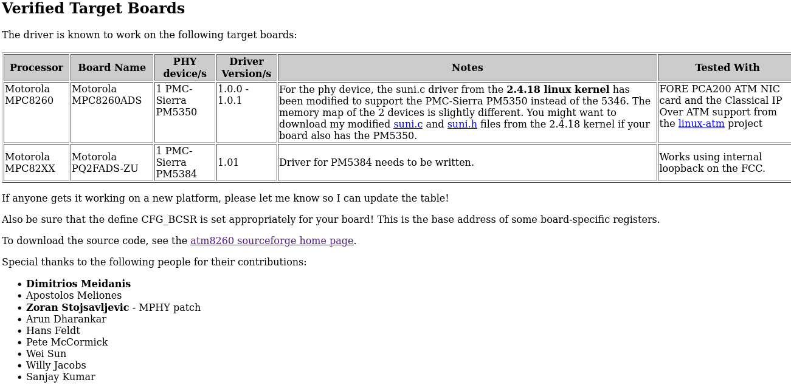

## Linux ATM driver for Motorola MPC8260
* [atm8260](https://sourceforge.net/projects/atm8260)

### Zoran's patch for MPHY support
* [MPHY-to-atm8260-1.0.1_diff.bz2](https://sourceforge.net/p/atm8260/patches/1/)

### MPHY supported in mpc8260sar

Email announcing this support: Wed Aug 18 17:31:34 EST 2004

* [MPHY supported in mpc8260sar](https://lists.ozlabs.org/pipermail/linuxppc-embedded/2004-August/015339.html)

### An atm driver for the Motorola MPC82XX processor family
* [atm8260.sourceforge.net](https://atm8260.sourceforge.net)

### Contributions

### SPECIAL THANKS TO JOVICA MRDALJ

* [UNIX: punom snagom](https://www.isbns.net/isbn/9788679910431)

	UNIX: punom snagom
	by Dragan Marković (Urednik)
	Dejan Živković
	Danica Kovačević
	Gordana Bjelajac
	Jovica Mrdalj

	Unknown, Published 1998

	ISBN 9788679910431
	8679910430 | 86-7991-043-0 | 978-8679910431 | 978-86-7991-043-1
