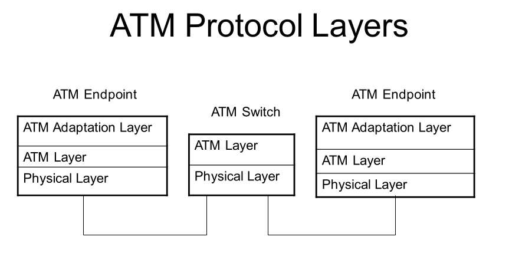

## What Does Asynchronous Transfer Mode Mean?

Asynchronous transfer mode (ATM) is a switching technique as
lower part of the Data Link layer used by telecommunication
networks that uses asynchronous time-division multiplexing
to encode data into small, fixed-sized cells. When ATM was
introduced around the beginning of 1990s, the fixed size of
the cells were undetermined. Some creators wanted to have
cell of 32 8-bit octets (for voice transfers), some 64
octets (for data transfers).

The neutral decision was made: (32+64)/2 = 48 8-bit octets.
Plus header of 5 8-bit octets. This was the final decision:
53 8-bit (5 octets header, 48 octets data).

This is different from Ethernet, or better definition will
be global one: Internet over Ethernet, which use variable
packet sizes for data or frames. ATM was designed as the
core protocol used over the synchronous optical network
(SONET) backbone of the integrated digital services network
(ISDN).

A virtual circuit or connection must be established before the
two endpoints can actually exchange data. After the connection
is set up, all cells reach their destination by following the
same path. Each cell comprises a 5 bytes header and a 48 bytes
payload, for a total of 53 bytes.

Traffic rate can be constant or variable. ATM creates fixed
routes between two points before data transfer begins, which
differs from internet protocol suite (TCP/IP), where data is
divided into packets, each of which takes a different route
to get to its destination. This makes it easier to bill data
usage. An ATM network is less adaptable to a sudden network
traffic surge.

The ATM provides data link layer services that run on the OSI’s
Layer 1 physical links. It functions much like small-packet
switched and circuit-switched networks, which makes it ideal
for real-rime, low-latency data such as VoIP and video, as
well as for high-throughput data traffic like file transfers.

Since all cells have a fixed length, the network traffic is
easily predictable, and thanks to the inbuilt clocking of cells,
quick cell switching is possible. This ensures that the quality
of service levels can be easily guaranteed to the end-user.

ATM services generally have four different bit rate choices:

	• Available Bit Rate (ABR): Provides a guaranteed minimum
	  capacity but data can be bursted to higher capacities when
	  network traffic is minimal.

	• Constant Bit Rate (CBR): Specifies a fixed bit rate so
	  that data is sent in a steady stream. This is analogous to
	  a leased line.

	• Unspecified Bit Rate (UBR): Doesn’t guarantee any throughput
	  level and is used for applications such as file transfers
	  that can tolerate delays.

	• Variable Bit Rate (VBR): Provides a specified throughput,
	  but data is not sent evenly. This makes it a popular choice
	  for voice and videoconferencing.

### ATM Protocol Layers

#### Physical Layer

	• Physical Layer: The lowest layer in the ATM protocol. It
	  describes the physical transmission media. It can use
	  shielded and unshielded twisted pair, coaxial cable, and
	  fiber-optic cable.

#### ATM Layer

	• ATM Layer: It performs all functions relating to the routing
	  and multiplexing of cells over VCs. It generates a header to
	  the segment streams generated by the AAL. Similarly, on receipt
	  of a cell streams, it removes the header from the cell and pass
	  the cell contents to the AAL protocol. To perform all these
	  functions, the ATM layer maintains a table which contains a
	  list of VCIs.

#### ATM Adaptation Layer

	• ATM Adaptation Layer: Top layer in the ATM protocol
	  Model. It converts the submitted information into streams of
	  48-octet segments and transports these in the payload field of
	  multiple ATM cells. Similarly, on receipt of the stream of cells
	  relating to the same call, it converts the 48-octet information
	  field into required form for delivery to the particular higher
	  protocol layer. Currently five service types have been defined.
	  They are referred to as AAL1-5. AAL1 and AAL2 are connection
	  oriented. AAL1 provides a constant bit rate (CBR service, where
	  as AAL2 provides a variable bit rate (VBR) service. Initially,
	  AAL3 was defined to provide connection oriented and VBR service.
	  Later, this service type was dropped and it is now merged with
	  AAL4. Both AAL3/4 and AAL5 provide a similar connectionless VBR
	  service.

### Literature

Excellent reading about ATM:

* [ATM.pdf](https://www.gangainstitute.com/wp-content/uploads/2019/09/ATM.pdf)

Asynchronous Transfer Mode - ATM - Network Encyclopedia

* [Asynchronous Transfer Mode - ATM](https://www.youtube.com/watch?v=LrUrexb_qLA)
